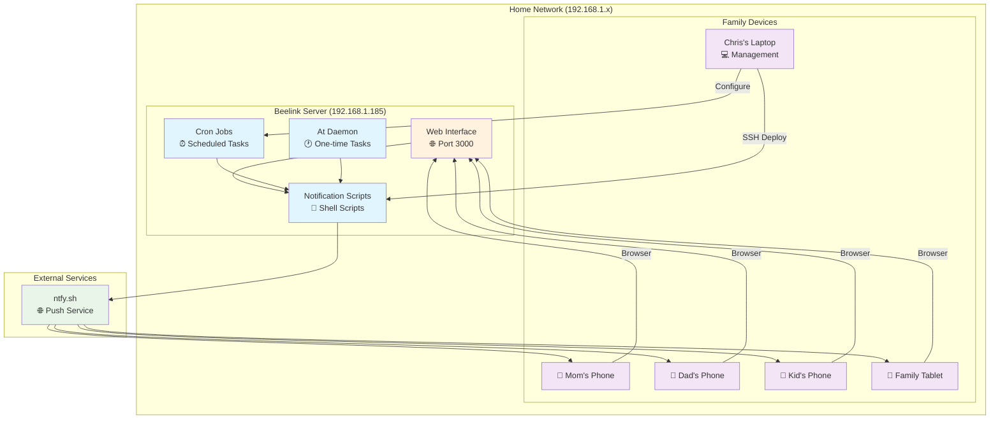

# Family Notification System

A distributed family notification system using your **Beelink home server** as the central hub for reliable 24/7 notifications via ntfy.

## Architecture Overview



## Why Beelink Server Architecture?

### 🏠 **Centralized Home Hub**
- **Always On**: 24/7 operation for reliable scheduled reminders
- **Low Power**: Energy efficient for continuous operation
- **Local Control**: No dependency on external services for scheduling
- **Family Access**: Single point for all family notification management

### 🔄 **Distributed Notifications**
- **Server**: Handles all scheduling and triggers + web interface
- **ntfy.sh**: Reliable push delivery service
- **Devices**: Receive notifications instantly via ntfy app + can send via web

### 📡 **Network Flow**
1. **Management**: Deploy/configure from laptop via SSH
2. **Family Access**: Use web interface at http://192.168.1.185:3000
3. **Scheduling**: Server runs cron jobs and at commands
4. **Delivery**: Server sends to ntfy.sh → pushes to all family devices
5. **Reliability**: Local server + cloud delivery = best of both worlds

## Quick Start

### 1. Server Setup (One-time)
```bash
# Deploy to beelink server
./deploy_to_beelink.sh

# SSH to server and setup
ssh -l chris 192.168.1.185
cd /home/chris/ntfy-family
./server_setup.sh

# Install web interface
cd web
./install_web_service.sh
```

### 2. Family Device Setup
1. **Download ntfy app** on all family devices
2. **Subscribe to topic**: `family-alerts-tw-ca-bby`
3. **Bookmark web interface**: http://192.168.1.185:3000
4. **Test**: Send notification via web or CLI

### 3. Start Using

#### 🌐 **Web Interface** (Recommended for Family)
- Open http://192.168.1.185:3000 in any browser
- Send instant notifications with quick buttons
- Schedule one-time reminders with date/time picker
- Set up recurring reminders (daily/weekly/monthly)

#### 💻 **Command Line** (For Advanced Users)
```bash
# Send immediate notification (from server)
./send_notification.sh "Dinner's ready! 🍽️"

# Schedule one-time reminder (from server)
./quick_reminder.sh

# Set up recurring reminders (from server)
./add_cron_reminder.sh
```

## Server Components

### 🖥️ **Beelink Server Scripts**
- `family_reminders.sh` - Interactive menu for all functions
- `send_notification.sh` - Send immediate notifications  
- `quick_reminder.sh` - Schedule one-time reminders
- `add_cron_reminder.sh` - Set up recurring reminders

### 🚀 **Deployment Scripts**
- `deploy_to_beelink.sh` - Deploy system to server
- `server_setup.sh` - Configure server dependencies
- `disable_cli_mode.sh` - Create non-interactive versions

### 🌐 **Web Interface**
- `web/index.html` - Beautiful responsive web interface
- `web/server.py` - Python web server with API endpoints
- `web/start_web_server.sh` - Manual server startup
- `web/install_web_service.sh` - Install as systemd service

## Usage Patterns

### 🏠 **Server-Based Operations** (Recommended)
```bash
# SSH to server first
ssh -l chris 192.168.1.185

# Then run commands on server
./send_notification.sh "Dinner's ready! 🍽️"
./family_reminders.sh
./add_cron_reminder.sh
```

### 💻 **Remote Management** (From Laptop)
```bash
# Deploy updates
./deploy_to_beelink.sh

# Quick remote notification
ssh -l chris 192.168.1.185 "cd /home/chris/ntfy-family && ./send_notification.sh 'Message from laptop'"
```

## Server Cron Examples

```bash
# Daily morning reminder at 7:30 AM (runs on server)
30 7 * * * /home/chris/ntfy-family/send_notification.sh "Good morning family! 🌅"

# Weekly family meeting (Sunday 2 PM)
0 14 * * 0 /home/chris/ntfy-family/send_notification.sh "Family meeting time! 👨‍👩‍👧‍👦"

# Bedtime reminder (9:30 PM)
30 21 * * * /home/chris/ntfy-family/send_notification.sh "Bedtime reminder! 😴"

# Medication reminder (twice daily)
0 8,20 * * * /home/chris/ntfy-family/send_notification.sh "💊 Time for medication"
```

## System Requirements

### 🖥️ **Beelink Server**
- Linux (Ubuntu/Debian recommended)
- curl, cron, at daemon
- Network connectivity to ntfy.sh
- SSH access enabled

### 📱 **Family Devices**
- ntfy app installed
- Subscribed to: `family-alerts-tw-ca-bby`
- Internet connectivity for push notifications

## Deployment Architecture Benefits

### ✅ **What Works Best**
- **Server-centric**: All scheduling happens on always-on beelink
- **Centralized management**: SSH from laptop to configure
- **Distributed delivery**: ntfy.sh handles push to all devices
- **Hybrid approach**: Local control + cloud delivery reliability

### ❌ **What Doesn't Work Well**
- Running cron jobs on laptop (not always on)
- Managing multiple notification sources
- Relying only on local network (no internet backup)
- Manual notification sending from multiple devices

## Advanced Usage

### 🔧 **Non-Interactive Mode** (For Automation)
```bash
# Run disable_cli_mode.sh to create silent versions
./disable_cli_mode.sh

# Then use automated scripts
./send_notification_silent.sh "Automated message"
./quick_reminder_auto.sh "Doctor visit" "2025-07-15 14:30" 60
./add_cron_auto.sh "Daily medicine" "0 8 * * *"
```

### 🌐 **Web Interface Features**
- **📱 Responsive Design**: Works on phones, tablets, computers
- **⚡ Quick Buttons**: Pre-made messages (dinner ready, leaving soon, etc.)
- **📅 Date/Time Picker**: Easy scheduling with visual calendar
- **🔄 Recurring Setup**: Daily, weekly, monthly reminders
- **✅ Real-time Feedback**: Instant confirmation of sent notifications
- **🎨 Modern UI**: Clean, family-friendly interface

### 🔌 **API Endpoints**
The web server provides REST API endpoints:
- `POST /api/send-notification` - Send immediate notification
- `POST /api/schedule-reminder` - Schedule one-time reminder
- `POST /api/add-recurring` - Add recurring reminder
- `GET /health` - Server health check

### 🏠 **Home Automation Integration**
Easy to integrate with:
- Home Assistant
- Node-RED
- IFTTT/Zapier
- Smart home devices
- Voice assistants

## Email (Work in Progress)

Email functionality is in the `email_WIP/` folder for future development.

## Contributing

Feel free to fork and improve! This is a family project that grew into something useful.

## License

MIT License - Use it however you want!
